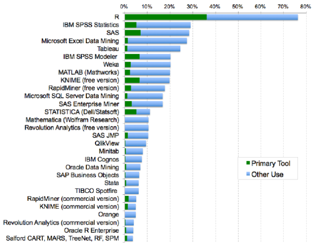
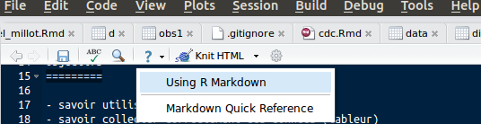
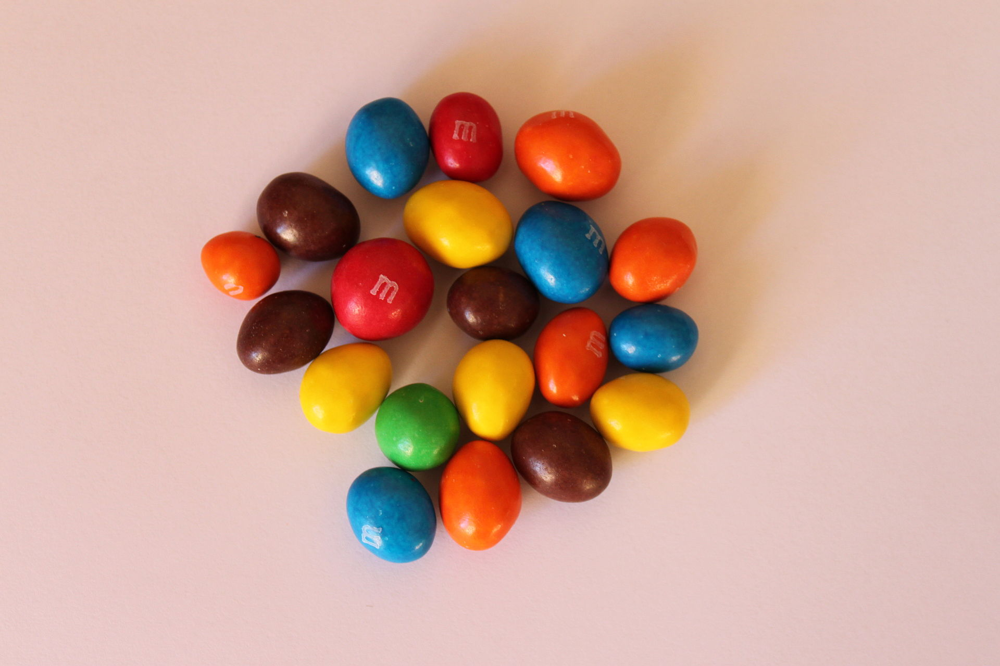

Objectifs
=========

- savoir utiliser un logiciel de statistiques
- savoir collecter correctement des données (tableur)
- transmettre les données au logiciel
- appliquer une démarche statistique

Le logiciel R parmis les autres logiciels statistiques
======================================================



source:

Organiser son travail
======================

- Démarrer RStudio
- Créer un nouveau _Projet__ dans un nouveau répertoire (directory): File/New project -> New directory
- Créer un sous répertoire __Data__ qui servira à stocker les données
- Créer un sous répertoire __Cours_Stat_2015__

Savoir utiliser un logiciel de statistiques
============================================

- Utilisation de __R__ (chercher _[CRAN](https://cran.r-project.org/)_ The Comprehensive R Archive Network).
- c'est à la fois un language de programmation (on peut écrire ses propres routines) et un logiciel statistique.
- __R__ est _libre_, _gratuit_, _multiplateforme_, _complet_, _évolutif_ grâce à une énorme bibliothèque de fonctions appelées __Pakages__ (environ 6000 à ce jour).
- On peut l'utiliser nativement ou par l'intermédiaire d'un IDE appelé __RStudio__.
- _RStudio_ utilise le concept de __recherche reproductible__ et permet de mettre en place une chaîne de production allant de la saisie des données à la production d'un document (mémoire, thèse, etc.) publiable.

Caractéristiques de RStudio
---------------------------

### 4 fenêtres

- Ouvrir une nouvelle page de travail: file -> New File -> R Markdown...
- __Enregistrer__ le document dans le dossier __Cours_Stat_2015__

### RMarkdown

Un [traitement de texte simple](http://rmarkdown.rstudio.com/) pour prendre des __notes__



### les "Chunks"

Aujourd'hui, je crée mon premier programme R en fusionnant mon texte, mes calculs et graphiques dans le même document grace aux _chunks_:
```{r}
print("Hello, R")

a <- 2 + 2
a
```

Il semble que 2 + 2 fassent `r a`

### Produire un document

A partir de ce document écrit avec _markdown_ je peut produire directement:

- un document __Html__ pour un navigateur (site internet, blog...)
- un document __Pdf__ non modifiable à distribuer
- document __Word__ ou __Libre Office__ modifiable
- un _diaporama__ à projeter
- un fichier des __graphiques__ crées pouvant ^etre copiés/collés dans n'importe quel document.


La démarche statistique
=======================

1. Collecte de données
--------------------
et leur mise en forme pour être exploitées, c'est 80% du travail.

2. Statistiques descriptives
-------------------------
Nous allons générer des statistiques qui résument les données de façon concise, et d'évaluer les différents
des moyens pour visualiser les données.

3. L'analyse exploratoire des données
-------------------------------------
Nous allons rechercher des modèles, les différences, et d'autres caractéritiques qui répondent aux questions
nous sommes intéressés à. Dans le même temps, nous allons vérifier les incohérences et identifier
limitations.

4. estimation
-------------
Nous allons utiliser les données à partir d'un échantillon pour estimer les caractéristiques de la population générale.

5. Tests d'hypothèses
---------------------
Où l'on voit les effets apparents, comme une différence entre deux groupes, nous évaluerons
si l'effet pourrait être dû au hasard.

La collecte des données
=======================

Application: analyse des friandises contenues dans un paquet de [M&M's](http://fr.wikipedia.org/wiki/M%26M%27s) fabriquées à Haguenau.



Noter dans un tableur:

- nom
- couleur: __R__ed, __Y__ellow, __G__reen, __B__lue, __M__aroon, __B__lack

- nombre
- aspect: __E__bréché, __F__endu, __P__arfait, __N__on marqué

```{r}
# Récupération des données
source('~/Documents/CESU/Cours-Stat/IFSI/Haguenau/haguenau.R')
# data_mms <- slurp("Data/")

```


Manipulation de R
=================

- dans __R__ on stocke des données dans des conteneurs appelés __variables__ que l'un désigne par un __nom__: n, x, tartampion, ...
- pour relier la variable __n__ à une valeur, on utilise le symbole d'affectation "<-"

```{r}
n <- 10
n * n
b <- n * n / 5
```

Créer un vecteur de données
----------------------------

Un vecteur est un groupe de données créé avec l'opérateur de __c__oncaténation
```{r}
ages <- c(25, 18, 21, 21, 23, 22, 23, 18, 25, 19, 22, 22, 22, 22)
ages

n <- 1:10
```

Tableau de données
------------------

- Un tableau rectangulaire de données constitue un __dataframe__
- une feuille de tableur au format __.csv__ est un exemple de _dataframe_
```{r}
data <- data.frame(Seatbelts)
head(data)
```


Paramètres statistiques de base
-------------------------------

- variables quantitatives (je peux les additionner): age, poids, taille....
- variables qualitatives (je peux les dénombrer sans équivoque): sexe, statut marital, CSP, couleur des cheveux...
    - nominale: l'ordre n'a pas d'importance: sexe
    - ordinales: l'ordre est important: échelle de Likert 
 
- ATTENTION: variables qualitatives qui se présentent comme des variables quantitatives: score de Glasgow

### taille

```{r}
n <- length(ages)
n
```

### Propotions et rapports [qual.]

```{r}
# on crée un vecteur de 12 hommes et 8 femmes avec la commande 'rep'ète et on vérifie avec la commande 'table'
sexe <- c(rep("H", 12), rep("F", 8))
sexe

ts <- table(sexe)
ts

hommes <- ts[2]
femmes <- ts[1]

rapport_de_masculinite <- hommes / femmes
rapport_de_masculinite

sex_ratio <- hommes / (hommes + femmes)
sex_ratio
```

### mode
Le mode identifie la valeur la plus fréquemment observée
```{r}
# pas de fonction, il faut en créer une
names(sort(-table(a)))[1]

```


### moyenne (mean) [quant.]

```{r}
(25 + 18 + 21 + 21 + 23 + 22 + 23 + 18 + 25 + 19 + 22) / 11

sum(ages) / length(ages)

mean(ages)
```

### Variance (variance) [quant.]

C'est la moyenne des écarts à la moyenne. Plus la variance est grande et plus l'effectif est dispersé.
```{r}
var(ages)
```


### écart-type (standard déviation) [quant.]

C'est la racine carrée de la variance
```{r}
sd(ages)
```
Si les données se distribuent selon un __loi normale__, alors 99% des données se situent dans l'intervalle défini par la moyenne +/- 3 fois l'écart-type.


Graphiques
----------

### camemgerts (pie-chart)

```{r}
pie(ts)
pie(ts, main = "Répartitions homme/femmes")
```

### Histogramme [quant.]

Conducteurs anglais tués par mois de janvier 1969 à décembre 1984.

```{r}
data <- data.frame(Seatbelts)
data$an <- time(Seatbelts)
data$mois <- cycle(Seatbelts)
hist(data$DriversKilled)
hist(data$DriversKilled, ylab = "Fréquence", xlab = "Nomnre de tués", main = "Nombre de tués sur les routes anglaises\n de 1969 à 1984", col = "cornflowerblue", border = "white")

m <- mean(data$DriversKilled)
s <- sd(data$DriversKilled)
x <- seq(60, 200, 0.1)
lines(x, dnorm(x, m, s) * 4400, type = "l", col="blue")

```

### Barplot [quant.]

```{r}
mm.counts <- c(12,6,8,10,6,7)
mm.colors <- c("blue","brown","green","orange","red","yellow")
names(mm.counts) <- mm.colors
barplot(mm.counts, main="Mon paquet de  M&M ",xlab="Couleur des M&M",ylab="Nombre de M&Ms dans le sachet", col=mm.colors)
```

### Boites à moustaches (Boxplot) [quant./qual.]

Une boxplot résume sur le même graphique 5 informations:

- minimum
- maximum
- 1er quartiles (25% des valeurs)
- médiane = 2éme quartile (50% des valeurs)
- 3ème quartile (75% des valeurs)

Exemple: comparaison du nombre mensuel de blessés graves selon le siège occuppé:
```{r}
data <- data.frame(Seatbelts) # on récupère les données
boxplot(data$front, data$rear)
# avec habillage
boxplot(data$front, data$rear, 
        names = c("passagers avant", "passagers arrière"), 
        ylab = "nombre de blessés graves", 
        main = "Nombre mensuel de blessés graves au cours des accidents de la voie publique\n en Angleterre (1969-2004) selon le siège occuppé",
        col = c("green", "yellow"))
```

Idem en prenant en compte le port de la ceinture de sécurité:
```{r}
d1 <- data[data$law < 1,] # 
d2 <- data[data$law > 0,]
boxplot(d1$front, d1$rear, d2$front, d2$rear, ylab = "Nombre de blessés graves", names = c("passager avant\n non ceinturé", "passager avant\n ceinturé", "passager arrière\n non ceinturé", "passager arrière\n ceinturé"), col = c("red","red","yellow","yellow"), main = "Impact de la ceinture de sécurité sur le nombre mensuel de blessés graves\n selon la place occuppée (Angleterre)")
```


Tests
-----

### Comparer deux moyennes (test de Student)

L'Angleterre à rendu obligatoire le port de la ceinture de sécurité sur les sièges avants le 31 décembre 1983.
Cette mesure à t'elle eu un impact sur la mortalité routière ?

- Hypothèse neutre (ou nulle ou H0): il n'y a pas de différence de mortalité chez les conducteurs anglais selon qu'ils portent ou non une ceinture de sécurité.

```{r}
data <- data.frame(Seatbelts) # on récupère les données
m <- tapply(data$DriversKilled, data$law, mean) # moyenne
s <- tapply(data$DriversKilled, data$law, sd) # écart-type
```
- mortalité mensuelle moyenne AVANT: `r m[1]` (+/- `r s[1]`)
- mortalité mensuelle moyenne APRES: `r m[2]` (+/- `r s[2]`)

Aspect graphique:
```{r}
x <- seq(40, 200, 0.1)
plot(x, dnorm(x, m[2], s[2]) * 4400, type = "l", col="blue", ylab = "Nombre de mois", main = "Mortalité routière avec et sans ceinture de sécurité")
lines(x, dnorm(x, m[1], s[1]) * 4400, type = "l", col="red")
legend("topright", legend = c("Avec ceinture", "Sans ceinture"), col = c("blue", "red"), lty = 1, bty = "n")
```

test: on compare la mortalité mensuelle moyenne avant et après la promulgation de la loi ave le test de Student. 

- Le test donne la probabilité (p) que la différence observée entre les deux moyennes soit due au hasard.
- C'est l'expérimentateur qui fixe le seuil à partir duquel on considère que ce n'est plus du hasard. De manière __consensuelle__ (accord d'expert) cette limite est fixée à __0.05__ ou __5%__.
- Si le résultat du test, p < 0.05, on considère que la différence n'est pas due au hasard et que l'hypothèse nulle doit être rejetée et par défaut on accepte l'hypothèse alternative: "le port de la ceinture de sécurité à un impact sur la mortalité des conducteurs"

```{r}
# test
t.test(data$DriversKilled ~ data$law, var.equal = TRUE)

```

__Question:__ peut-on tirer les mêmes conclusions pour les blessés graves situés à l'avant (colonne 'front') ou situés à l'arrière (colonne 'rear') du véhicule ?


Transféréer les données
=======================

Passer du tableur à __R__
-------------------------

- format d'échange universel: .csv (comma separated values)
- Tableur -> Enregistrer sous -> TEXT CSV (.csv)
- ouvrir le fichier à partir de R avec __read.csv__

Travail collaboratif
--------------------

- respectueux de la vie privée: __Framacalc__ (+++) https://framacalc.org/_start

        - libre, gratuit (dons à partir de 5€)
        - permet de travailler à plusieurs sur le même tableur
        - import direct à partir de __R__: https://framacalc.org/le_nom_de_mon_calc.csv
        - exemple: https://framacalc.org/qKe5wD44QU
- Traitement de texte collaboratif: https://framapad.org/
- Organiser des réunions: http://framadate.org/
- Mind Mapping: http://framindmap.org/

Lecture du tableur Framasoft
----------------------------

- nécessite le package RCurl pour connexion sécurisée (Https)
- pour récupérer les données au format .csv, il suffit d'ajouter ".csv" au nom du tableur
- le datafrme contient l'analyse d'un paquet de 330 grammes de m&ms

```{r}
library(RCurl)
jcb_url <- getURL("https://framacalc.org/qKe5wD44QU.csv")
jcb_data <- read.csv(textConnection(jcb_url), header = TRUE)
# jcb_data

str(jcb_data)
summary(jcb_data)
hist(jcb_data$VOLUME)

boxplot(jcb_data$VOLUME ~ jcb_data$COULEUR)

f <- aov(jcb_data$VOLUME ~ jcb_data$COULEUR)
f
summary(f)

```


Organiser un questionnaire en ligne
-----------------------------------

- __Lime survey__ (libre) [LimeSurvey](https://www.limesurvey.org/en/)
- __Form__ (propriétaire) google drive

Pour finir
===========

License: [Creative Commons Attribution-NonCommercial-ShareAlike 4.0 International License](http://creativecommons.org/licenses/by-nc-sa/4.0/)

You are free to:

- Share
- copy and redistribute the material
- Adapt
- rebuild and transform the material

Under the following conditions:

- Attribution: You must give appropriate credit, provide a link to the license, and indicate if changes were made.
- NonCommercial: You may not use this work for commercial purposes.
- Share Alike: If you remix, transform, or build upon this work, you must distribute your contributions under the same license to this one.