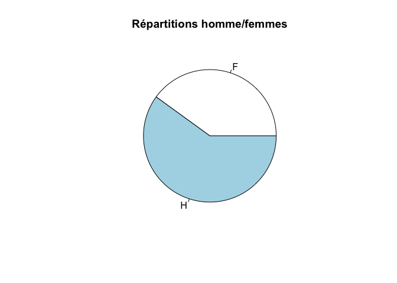
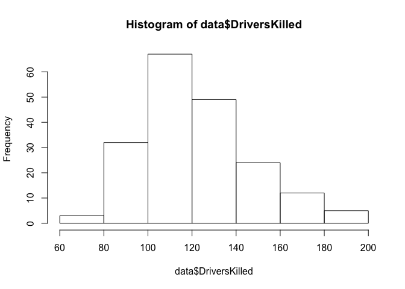

# Haguenau
JcB  
14/10/2015  

Objectifs
=========

- savoir utiliser un logiciel de statistiques
- savoir collecter correctement des données (tableur)
- transmettre les données au logiciel
- appliquer une démarche statistique

Organiser son travail
======================

- Démarrer RStudio
- Créer un nouveau _Projet__ dans un nouveau répertoire (directory): File/New project -> New directory
- Créer un sous répertoire __Data__ qui servira à stocker les données
- Créer un sous répertoire __Cours_Stat_2015__

Savoir utiliser un logiciel de statistiques
============================================

- Utilisation de __R__ (chercher _[CRAN](https://cran.r-project.org/)_ The Comprehensive R Archive Network).
- c'est à la fois un language de programmation (on peut écrire ses propres routines) et un logiciel statistique.
- __R__ est _libre_, _gratuit_, _multiplateforme_, _complet_, _évolutif_ grâce à une énorme bibliothèque de fonctions appelées __Pakages__ (environ 6000 à ce jour).
- On peut l'utiliser nativement ou par l'intermédiaire d'un IDE appelé __RStudio__.
- _RStudio_ utilise le concept de __recherche reproductible__ et permet de mettre en place une chaîne de production allant de la saisie des données à la production d'un document (mémoire, thèse, etc.) publiable.

Caractéristiques de RStudio
---------------------------

### 4 fenêtres

- Ouvrir une nouvelle page de travail: file -> New File -> R Markdown...
- __Enregistrer__ le document dans le dossier __Cours_Stat_2015__

### RMarkdown

Un [traitement de texte simple](http://rmarkdown.rstudio.com/) pour prendre des __notes__


### les "Chunks"

Aujourd'hui, je crée mon premier programme R en fusionnant mon texte, mes calculs et graphiques dans le même document grace aux _chunks_:

```r
print("Hello, R")
```

```
## [1] "Hello, R"
```

```r
a <- 2 + 2
a
```

```
## [1] 4
```

Il semble que 2 + 2 fassent 4

### Prouire un document

A partir de ce document écrit avec _markdown_ je peut produire directement:

- un document __Html__ pour un navigateur (site internet, blog...)
- un document __Pdf__ non modifiable à distribuer
- document __Word__ ou __Libre Office__ modifiable
- un _diaporama__ à projeter
- un fichier des __graphiques__ crées pouvant ^etre copiés/collés dans n'importe quel document.


La démarche statistique
=======================

1. Collecte de données
--------------------
et leur mise en forme pour être exploitées, c'est 80% du travail.

2. Statistiques descriptives
-------------------------
Nous allons générer des statistiques qui résument les données de façon concise, et d'évaluer les différents
des moyens pour visualiser les données.

3. L'analyse exploratoire des données
-------------------------------------
Nous allons rechercher des modèles, les différences, et d'autres caractéritiques qui répondent aux questions
nous sommes intéressés à. Dans le même temps, nous allons vérifier les incohérences et identifier
limitations.

4. estimation
-------------
Nous allons utiliser les données à partir d'un échantillon pour estimer les caractéristiques de la population générale.

5. Tests d'hypothèses
---------------------
Où l'on voit les effets apparents, comme une différence entre deux groupes, nous évaluerons
si l'effet pourrait être dû au hasard.

La collecte des données
=======================

Application: analyse des friandises contenues dans un paquet de [M&M's](http://fr.wikipedia.org/wiki/M%26M%27s) fabriquées à Haguenau.


Noter dans un tableur

- nom
- couleur
- nombre
- aspect


Manipulation de R
=================

- dans __R__ on stocke des données dans des conteneurs appelés __variables__ que l'un désigne par un __nom__: n, x, tartampion, ...
- pour relier la variable __n__ à une valeur, on utilise le symbole d'affectation "<-"


```r
n <- 10
n * n
```

```
## [1] 100
```

```r
b <- n * n / 5
```

Créer un vecteur de données
----------------------------

Un vecteur est un groupe de données créé avec l'opérateur de __c__oncaténation

```r
ages <- c(25, 18, 21, 21, 23, 22, 23, 18, 25, 19, 22, 22, 22, 22)
ages
```

```
##  [1] 25 18 21 21 23 22 23 18 25 19 22 22 22 22
```

```r
n <- 1:10
```

Tableau de données
------------------

- Un tableau rectangulaire de données constitue un __dataframe__
- une feuille de tableur au format __.csv__ est un exemple de _dataframe_

```r
data <- data.frame(Seatbelts)
head(data)
```

```
##   DriversKilled drivers front rear   kms PetrolPrice VanKilled law
## 1           107    1687   867  269  9059   0.1029718        12   0
## 2            97    1508   825  265  7685   0.1023630         6   0
## 3           102    1507   806  319  9963   0.1020625        12   0
## 4            87    1385   814  407 10955   0.1008733         8   0
## 5           119    1632   991  454 11823   0.1010197        10   0
## 6           106    1511   945  427 12391   0.1005812        13   0
```


Paramètres statistiques de base
-------------------------------

- variables quantitatives (je peux les additionner): age, poids, taille....
- variables qualitatives (je peux les dénombrer sans équivoque): sexe, statut marital, CSP, couleur des cheveux...
    - nominale: l'ordre n'a pas d'importance: sexe
    - ordinales: l'ordre est important: échelle de Likert 
 
- ATTENTION: variables qualitatives qui se présentent comme des variables quantitatives: score de Glasgow

### taille


```r
n <- length(ages)
n
```

```
## [1] 14
```

### Propotions et rapports [qual.]


```r
# on crée un vecteur de 12 hommes et 8 femmes avec la commande 'rep'ète et on vérifie avec la commande 'table'
sexe <- c(rep("H", 12), rep("F", 8))
sexe
```

```
##  [1] "H" "H" "H" "H" "H" "H" "H" "H" "H" "H" "H" "H" "F" "F" "F" "F" "F"
## [18] "F" "F" "F"
```

```r
ts <- table(sexe)
ts
```

```
## sexe
##  F  H 
##  8 12
```

```r
hommes <- ts[2]
femmes <- ts[1]

rapport_de_masculinite <- hommes / femmes
rapport_de_masculinite
```

```
##   H 
## 1.5
```

```r
sex_ratio <- hommes / (hommes + femmes)
sex_ratio
```

```
##   H 
## 0.6
```

### mode
Le mode identifie la valeur la plus fréquemment observée

```r
# pas de fonction, il faut en créer une
names(sort(-table(a)))[1]
```

```
## [1] "4"
```


### moyenne (mean) [quant.]


```r
(25 + 18 + 21 + 21 + 23 + 22 + 23 + 18 + 25 + 19 + 22) / 11
```

```
## [1] 21.54545
```

```r
sum(ages) / length(ages)
```

```
## [1] 21.64286
```

```r
mean(ages)
```

```
## [1] 21.64286
```

### Variance (variance) [quant.]

C'est la moyenne des écarts à la moyenne. Plus la variance est grande et plus l'effectif est dispersé.

```r
var(ages)
```

```
## [1] 4.708791
```


### écart-type (standard déviation) [quant.]

C'est la racine carrée de la variance

```r
sd(ages)
```

```
## [1] 2.169975
```
Si les données se distribuent selon un __loi normale__, alors 99% des données se situent dans l'intervalle défini par la moyenne +/- 3 fois l'écart-type.


Graphiques
----------

### camemgerts (pie-chart)


```r
pie(ts)
```

 

```r
pie(ts, main = "Répartitions homme/femmes")
```

 

### Histogramme [quant.]

Conducteurs anglais tués par mois de janvier 1969 à décembre 1984.


```r
data <- data.frame(Seatbelts)
data$an <- time(Seatbelts)
data$mois <- cycle(Seatbelts)
hist(data$DriversKilled)
```

 

```r
hist(data$DriversKilled, ylab = "Fréquence", xlab = "Nomnre de tués", main = "Nombre de tués sur les routes anglaises\n de 1969 à 1984", col = "cornflowerblue", border = "white")

m <- mean(data$DriversKilled)
s <- sd(data$DriversKilled)
x <- seq(60, 200, 0.1)
lines(x, dnorm(x, m, s) * 4400, type = "l", col="blue")
```

 

### Barplot [quant.]


```r
mm.counts <- c(12,6,8,10,6,7)
mm.colors <- c("blue","brown","green","orange","red","yellow")
names(mm.counts) <- mm.colors
barplot(mm.counts, main="Mon paquet de  M&M ",xlab="Couleur des M&M",ylab="Nombre de M&Ms dans le sachet", col=mm.colors)
```

 


Transféréer les données
=======================

Passer du tableur à __R__
-------------------------

- format d'échange universel: .csv (comma separated values)
- Tableur -> Enregistrer sous -> TEXT CSV (.csv)
- ouvrir le fichier à partir de R avec __read.csv__

Organiser un questionnaire en ligne
-----------------------------------

- __Lime survey__ (libre) [LimeSurvey](https://www.limesurvey.org/en/)
- __Form__ (propriétaire) google drive
