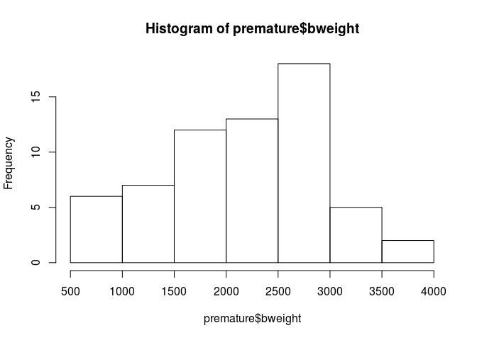
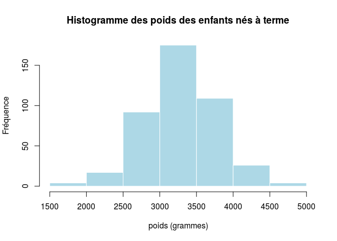
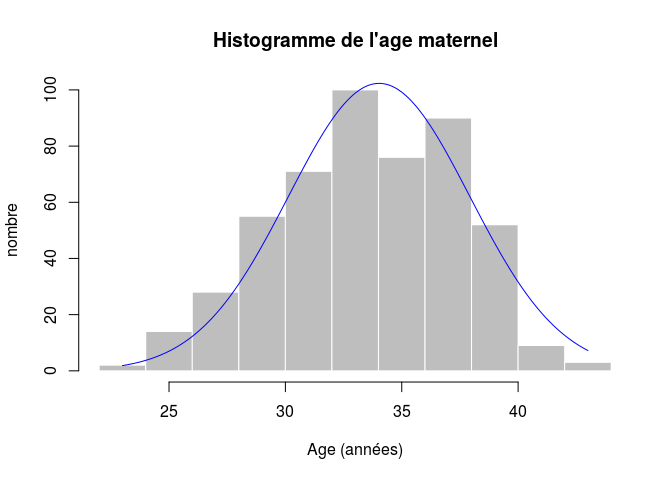
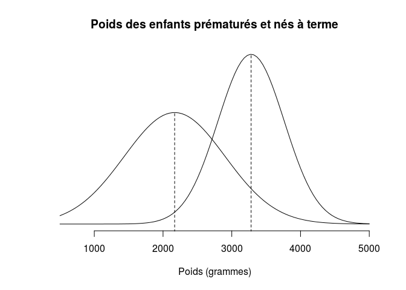
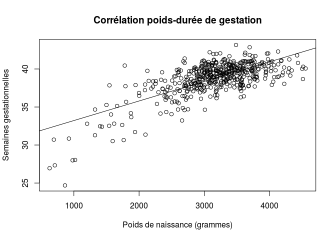
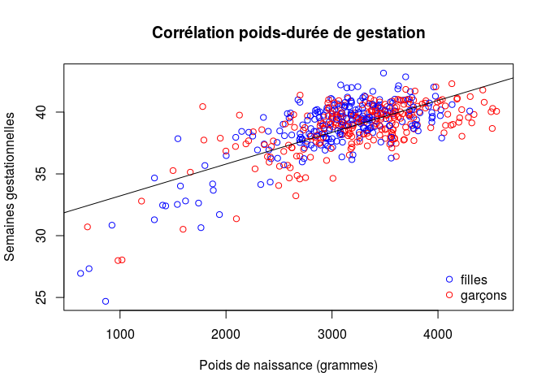
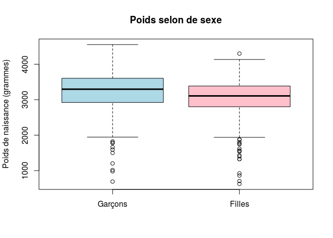
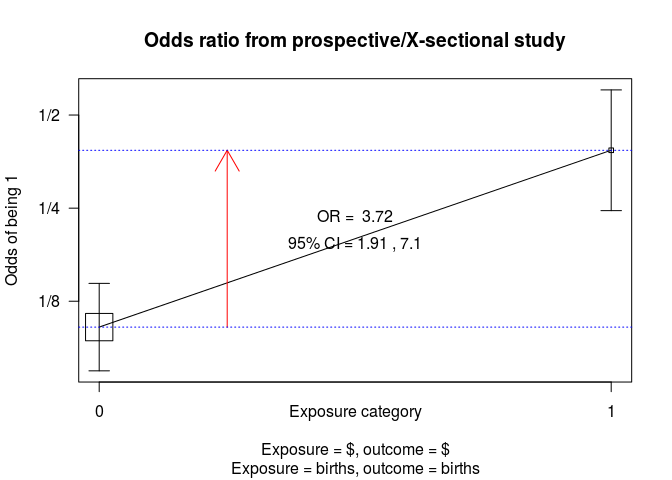
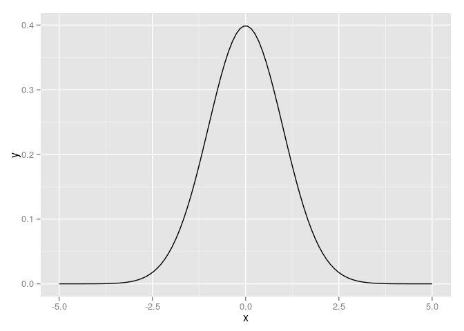
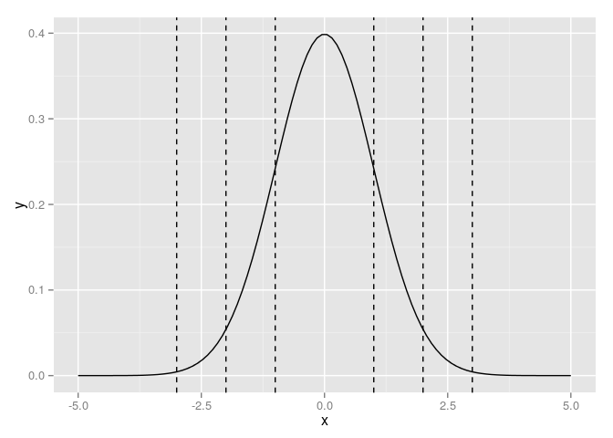

# Maternite
JcB  
17/08/2014  

source:

- package __Epi__
- Gebolini Christophe: [Lire, compter, tester... avec R](http://cran.r-project.org/doc/contrib/Genolini-LireCompterTesterR.pdf)

Plan
====

- Présentation de la structure d'un article médical
- Statistique: méthode scientifique pour rendre les données compréhensibles afin de tirer des conclusions pertinentes (ex du cholera avec john snow). Quatre étapes
        - statistique descriptive
        - statistique inférentielle
        - modélisation
- domaines connexes: astronomie (Neptune), Big Data, sondages d'opinion, démographie, épidémiologie, cartographie, pharmacologie...
- les données: matière première du statisticien
- cas clinique: Births
        - description des variables
        - paramètres de position et de dispersion: moyenne, variance, écart-type, médiane
        - représentation graphique
        - corrélation
        - comparaison de deux groupes: les tests  d'hypothèse
        - ANOVA

births Births in a London Hospital
==================================

Description
-----------
Données provenant de 500 naissances uniques (singleton births) dans un hôpital de Londres.

Origine: données __Births__ du pacfage __epi__.

Usage

data(births)

Format (Métadonnées)
------
Un tableau (data frame) de 500 observations concernant les 8 variables suivantes:


variable  |  signification   
----------|---------------  
__id__  |  Identifiant pour la mère et l'enfant   
__bweight__  |  Poids de naissance
__lowbw__ | Poids inférieur à 2500 g (0 = non, 1 = oui)
__gestwks__| Durée de la grossesse (semaines)
__preterm__| Durée de gestation inférieure à 37 weeks (0 = non, 1 = oui)
__matage__| Age maternel
__hyp__| Hypertension gravidique (0 = non, 1 = oui)
__sex__| Sexe de l'enfant 1:garçon, 2:fille

Source
-------
Anonymous

References
Michael Hills and Bianca De Stavola (2002). A Short Introduction to Stata 8 for Biostatistics,[Timberlake Consultants Ltd](http://www.timberlake.co.uk)

[A short introduction to R for Epidemiology](http://bendixcarstensen.com/Epi/R-intro-SDC.pdf) page 6, paragraphe 2.5

Exploration des données
-----------------------


```

Attaching package: 'Epi'

The following object is masked from 'package:base':

    merge.data.frame
```

```
  id bweight lowbw gestwks preterm matage hyp sex
1  1    2974     0   38.52       0     34   0   2
2  2    3270     0      NA      NA     30   0   1
3  3    2620     0   38.15       0     35   0   2
4  4    3751     0   39.80       0     31   0   1
5  5    3200     0   38.89       0     33   1   1
6  6    3673     0   40.97       0     33   0   2
```

```
'data.frame':	500 obs. of  8 variables:
 $ id     : num  1 2 3 4 5 6 7 8 9 10 ...
 $ bweight: num  2974 3270 2620 3751 3200 ...
 $ lowbw  : num  0 0 0 0 0 0 0 0 0 0 ...
 $ gestwks: num  38.5 NA 38.2 39.8 38.9 ...
 $ preterm: num  0 NA 0 0 0 0 0 0 0 0 ...
 $ matage : num  34 30 35 31 33 33 29 37 36 39 ...
 $ hyp    : num  0 0 0 0 1 0 0 0 0 0 ...
 $ sex    : num  2 1 2 1 1 2 2 1 2 1 ...
```

```
       id           bweight     lowbw      gestwks      preterm   
 Min.   :  1.0   Min.   : 628   0:440   Min.   :24.69   0   :427  
 1st Qu.:125.8   1st Qu.:2862   1: 60   1st Qu.:37.94   1   : 63  
 Median :250.5   Median :3188           Median :39.12   NA's: 10  
 Mean   :250.5   Mean   :3137           Mean   :38.72             
 3rd Qu.:375.2   3rd Qu.:3551           3rd Qu.:40.09             
 Max.   :500.0   Max.   :4553           Max.   :43.16             
                                        NA's   :10                
     matage      hyp     sex    
 Min.   :23.00   0:428   1:264  
 1st Qu.:31.00   1: 72   2:236  
 Median :34.00                  
 Mean   :34.03                  
 3rd Qu.:37.00                  
 Max.   :43.00                  
                                
```

```
       id           bweight      lowbw        gestwks      preterm   
 Min.   :  1.0   Min.   :1546   0   :406   Min.   :37.04   0   :427  
 1st Qu.:124.5   1st Qu.:2980   1   : 21   1st Qu.:38.47   1   :  0  
 Median :250.0   Median :3282   NA's: 10   Median :39.49   NA's: 10  
 Mean   :249.9   Mean   :3281              Mean   :39.39             
 3rd Qu.:377.0   3rd Qu.:3582              3rd Qu.:40.24             
 Max.   :500.0   Max.   :4553              Max.   :43.16             
 NA's   :10      NA's   :10                NA's   :10                
     matage        hyp        sex     
 Min.   :23.00   0   :375   1   :225  
 1st Qu.:32.00   1   : 52   2   :202  
 Median :34.00   NA's: 10   NA's: 10  
 Mean   :34.08                        
 3rd Qu.:37.00                        
 Max.   :43.00                        
 NA's   :10                           
```

```
       id           bweight      lowbw       gestwks      preterm  
 Min.   : 22.0   Min.   : 628   0   :25   Min.   :24.69   0   : 0  
 1st Qu.:166.0   1st Qu.:1606   1   :38   1st Qu.:32.72   1   :63  
 Median :240.0   Median :2404   NA's:10   Median :35.14   NA's:10  
 Mean   :254.8   Mean   :2169             Mean   :34.17            
 3rd Qu.:360.5   3rd Qu.:2684             3rd Qu.:36.31            
 Max.   :479.0   Max.   :3606             Max.   :36.99            
 NA's   :10      NA's   :10               NA's   :10               
     matage       hyp       sex    
 Min.   :24.0   0   :44   1   :31  
 1st Qu.:31.0   1   :19   2   :32  
 Median :34.0   NA's:10   NA's:10  
 Mean   :33.9                      
 3rd Qu.:37.0                      
 Max.   :41.0                      
 NA's   :10                        
```

  

```
   Min. 1st Qu.  Median    Mean 3rd Qu.    Max. 
  23.00   31.00   34.00   34.03   37.00   43.00 
```

```
The following object is masked _by_ .GlobalEnv:

    preterm
```

  

```

	Pearson's product-moment correlation

data:  births$bweight and births$gestwks
t = 22.413, df = 488, p-value < 2.2e-16
alternative hypothesis: true correlation is not equal to 0
95 percent confidence interval:
 0.6656286 0.7532743
sample estimates:
      cor 
0.7122162 
```

   

```

	Welch Two Sample t-test

data:  births$bweight by births$sex
t = 3.4916, df = 492.91, p-value = 0.0005233
alternative hypothesis: true difference in means is not equal to 0
95 percent confidence interval:
  86.17495 307.96706
sample estimates:
mean in group 1 mean in group 2 
       3229.902        3032.831 
```

test d'indépendance du chi2
---------------------------
un poids faible à la naissance est idépendant de présence d'une HTA chez la mère ?

```r
library(epicalc)
```

```
Loading required package: foreign
Loading required package: survival
Loading required package: MASS
Loading required package: nnet
```

```r
t <- table(births$lowbw, births$hyp, dnn=c("Poids faible", "HTA gravidique"))
colnames(t) <- c("non","oui")
rownames(t) <- c("non","oui")
addmargins(t)
```

```
            HTA gravidique
Poids faible non oui Sum
         non 388  52 440
         oui  40  20  60
         Sum 428  72 500
```

```r
t
```

```
            HTA gravidique
Poids faible non oui
         non 388  52
         oui  40  20
```

```r
c2 <- chisq.test(t)
c2
```

```

	Pearson's Chi-squared test with Yates' continuity correction

data:  t
X-squared = 18.121, df = 1, p-value = 2.073e-05
```

```r
round(100*c2$residuals^2/c2$statistic, 1)
```

```
            HTA gravidique
Poids faible  non  oui
         non  1.9 11.2
         oui 13.9 82.4
```

```r
round(100*c2$residuals, 1)
```

```
            HTA gravidique
Poids faible    non    oui
         non   58.5 -142.7
         oui -158.5  386.5
```

```r
cc(births$lowbw, births$hyp)
```

 

```

            births$hyp
births$lowbw   0   1 Total
       0     388  52   440
       1      40  20    60
       Total 428  72   500

OR =  3.73 
Exact 95% CI =  1.91, 7.1  
Chi-squared = 19.83, 1 d.f., P value = 0
Fisher's exact test (2-sided) P value = 0 
```

Phenobarb (nlme)
=================

Format
------
Ce data frame contient les colonnes suivantes:

- _Subject_ un facteur ordonnépour identifier les enfants.
- _Wt_ un vecteur numérique indiquant le poids de naissance de l'enfant (kg).
- _Apgar_ un facteur ordonnéindiquant le score d'Apgar à 5 minutes. C'est une indication de l'état de santé de l'enfant.
- _ApgarInd_ un facteur indiquant si le score d'Apgar à 5 mn est < 5 ou >= 5.
- _time_ un vecteur numérique donnant le temps où l'échantillon est prélevé ou le médicament administré (hr).
- _dose_ un vecteur numérique donnant la dose de médicament administrée (ug/kg).
- _conc_ un vecteur numérique donnant la concentration de phenobarbital dans le serum (ug/L).

Details
-------

Données d'une étude de pharmacocinétique du phénobarbital chez les nouveau-nés. Au cours des premiers jours
de la vie les enfants reçoivent plusieurs doses de phénobarbital pour la prévention des crises convulsives.
Des échantillons de sang sont prélevés de manière irrégulière et les concentrations sériques de phénobarbital sont déterminées.
Les données ont été initialement donnés par Grasela et Donn (1985) et sont analysés dans Boeckmann, Sheiner et
Beal (1994), dans Davidian et Giltinan (1995), et en Littell et al. (1996).

```r
library(nlme)
d <- Phenobarb
str(d)
```

```
## Classes 'nfnGroupedData', 'nfGroupedData', 'groupedData' and 'data.frame':	744 obs. of  7 variables:
##  $ Subject : Ord.factor w/ 59 levels "42"<"28"<"30"<..: 32 32 32 32 32 32 32 32 32 32 ...
##  $ Wt      : num  1.4 1.4 1.4 1.4 1.4 1.4 1.4 1.4 1.4 1.4 ...
##  $ Apgar   : Ord.factor w/ 10 levels "1"<"2"<"3"<"4"<..: 7 7 7 7 7 7 7 7 7 7 ...
##  $ ApgarInd: Factor w/ 2 levels "< 5",">= 5": 2 2 2 2 2 2 2 2 2 2 ...
##  $ time    : num  0 2 12.5 24.5 37 48 60.5 72.5 85.3 96.5 ...
##  $ dose    : num  25 NA 3.5 3.5 3.5 3.5 3.5 3.5 3.5 3.5 ...
##  $ conc    : num  NA 17.3 NA NA NA NA NA NA NA NA ...
##  - attr(*, "formula")=Class 'formula' length 3 conc ~ time | Subject
##   .. ..- attr(*, ".Environment")=<environment: R_GlobalEnv> 
##  - attr(*, "labels")=List of 2
##   ..$ x: chr "Time"
##   ..$ y: chr "Serum phenobarbital concentration"
##  - attr(*, "units")=List of 2
##   ..$ x: chr "(hr)"
##   ..$ y: chr "(ug/L)"
##  - attr(*, "FUN")=function (x)  
##   ..- attr(*, "source")= chr "function (x) max(x, na.rm = TRUE)"
##  - attr(*, "order.groups")= logi TRUE
```

Courbe normale
==============

ref: Practical data science pp 334-335.


```r
library(ggplot2)
x <- seq(from=-5, to=5, length.out = 100)  # intervalle [-5 à 5]
f <- dnorm(x)                              # loi normale de moyenne 0 et sd = 1
ggplot(data.frame(x = x, y = f), aes(x = x, y = y)) + geom_line()
```

 

```r
ggplot(data.frame(x = x, y = f), aes(x = x, y = y)) + geom_line() + geom_vline(xintercept=c(-3,-2,-1,1,2,3), linetype=2)
```

 

- 68% des observations sont dans l'intervalle (m - sd, m + sd)
- 95% des observations sont dans l'intervalle (m - 2*sd, m + 2*sd)
- 99% des observations sont dans l'intervalle (m - 3*sd, m + 3*sd)

Une observation se situant à plus de 3 ecart-type est anormale.
