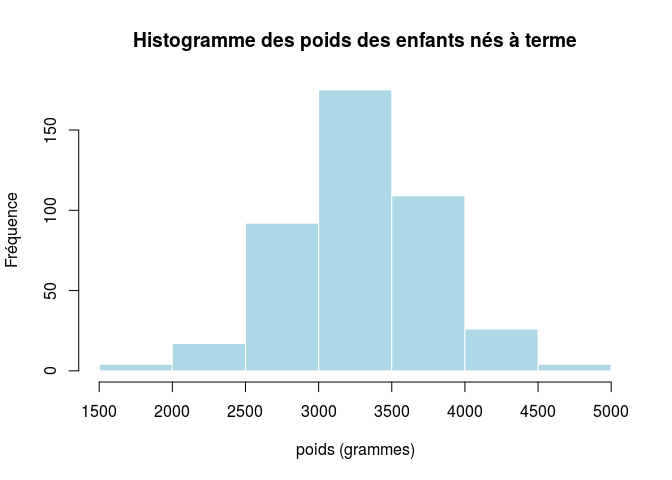
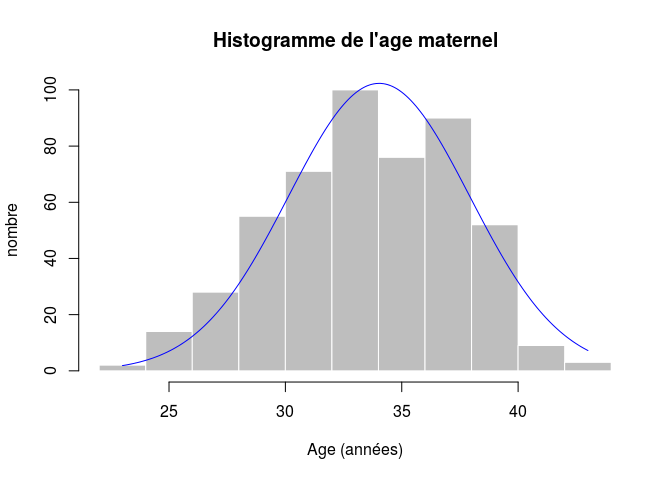
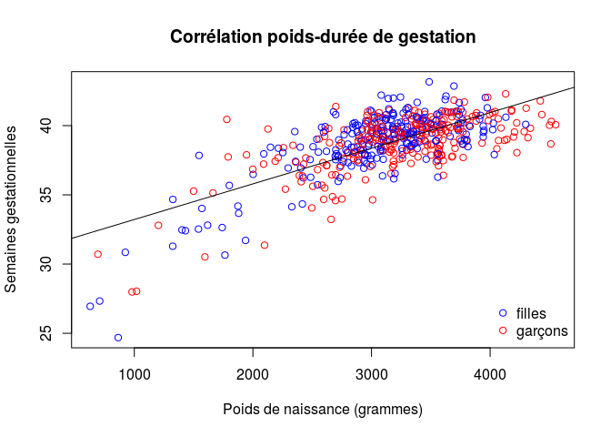
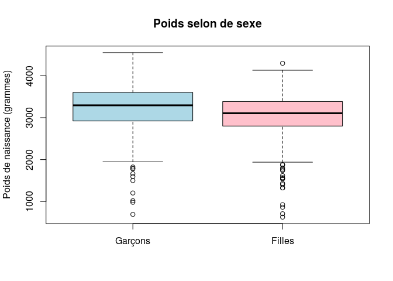
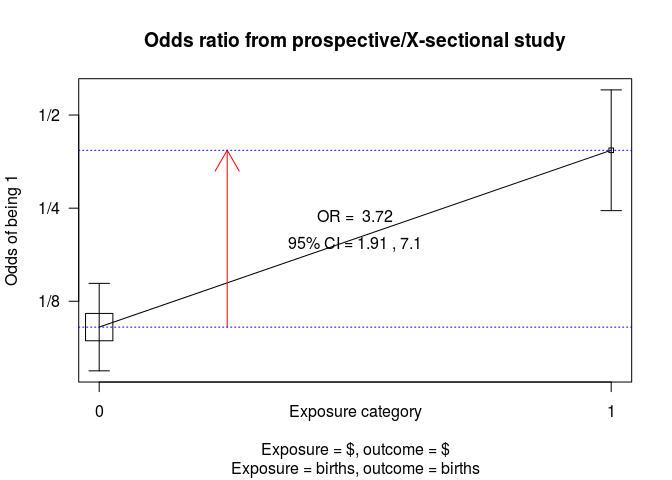

# Maternite
JcB  
17/08/2014  

source:

- package __epi__
- Gebolini Christophe: [Lire, compter, tester... avec R](http://cran.r-project.org/doc/contrib/Genolini-LireCompterTesterR.pdf)

Plan
====

- Présentation de la structure d'un article médical
- Statistique: méthode scientifique pour rendre les données compréhensibles afin de tirer des conclusions pertinentes (ex du cholera avec john snow). Quatre étapes
        - statistique descriptive
        - statistique inférentielle
        - modélisation
- domaines connexes: astronomie (Neptune), Big Data, sondages d'opinion, démographie, épidémiologie, cartographie, pharmacologie...
- les données: matière première du statisticien
- cas clinique: Births
        - description des variables
        - paramètres de position et de dispersion: moyenne, variance, écart-type, médiane
        - représentation graphique
        - corrélation
        - comparaison de deux groupes: les tests  d'hypothèse
        - ANOVA

births Births in a London Hospital
==================================

Description
-----------
Données provenant de 500 naissances uniques (singleton births) dans un hôpital de Londres.

Origine: données __Births__ du pacfage __epi__.

Usage

data(births)

Format (Métadonnées)
------
Un tableau (data frame) de 500 observations concernant les 8 variables suivantes:


variable  |  signification   
----------|---------------  
__id__  |  Identifiant pour la mère et l'enfant   
__bweight__  |  Poids de naissance
__lowbw__ | Poids inférieur à 2500 g (0 = non, 1 = oui)
__gestwks__| Durée de la grossesse (semaines)
__preterm__| Durée de gestation inférieure à 37 weeks (0 = non, 1 = oui)
__matage__| Age maternel
__hyp__| Hypertension gravidique (0 = non, 1 = oui)
__sex__| Sexe de l'enfant 1:garçon, 2:fille

Source
-------
Anonymous

References
Michael Hills and Bianca De Stavola (2002). A Short Introduction to Stata 8 for Biostatistics,[Timberlake Consultants Ltd](http://www.timberlake.co.uk)

[A short introduction to R for Epidemiology](http://bendixcarstensen.com/Epi/R-intro-SDC.pdf) page 6, paragraphe 2.5

Exploration des données
-----------------------


```

Attaching package: 'Epi'

The following object is masked from 'package:base':

    merge.data.frame
```

```
  id bweight lowbw gestwks preterm matage hyp sex
1  1    2974     0   38.52       0     34   0   2
2  2    3270     0      NA      NA     30   0   1
3  3    2620     0   38.15       0     35   0   2
4  4    3751     0   39.80       0     31   0   1
5  5    3200     0   38.89       0     33   1   1
6  6    3673     0   40.97       0     33   0   2
```

```
'data.frame':	500 obs. of  8 variables:
 $ id     : num  1 2 3 4 5 6 7 8 9 10 ...
 $ bweight: num  2974 3270 2620 3751 3200 ...
 $ lowbw  : num  0 0 0 0 0 0 0 0 0 0 ...
 $ gestwks: num  38.5 NA 38.2 39.8 38.9 ...
 $ preterm: num  0 NA 0 0 0 0 0 0 0 0 ...
 $ matage : num  34 30 35 31 33 33 29 37 36 39 ...
 $ hyp    : num  0 0 0 0 1 0 0 0 0 0 ...
 $ sex    : num  2 1 2 1 1 2 2 1 2 1 ...
```

```
       id         bweight     lowbw      gestwks     preterm   
 Min.   :  1   Min.   : 628   0:440   Min.   :24.7   0   :427  
 1st Qu.:126   1st Qu.:2862   1: 60   1st Qu.:37.9   1   : 63  
 Median :250   Median :3188           Median :39.1   NA's: 10  
 Mean   :250   Mean   :3137           Mean   :38.7             
 3rd Qu.:375   3rd Qu.:3551           3rd Qu.:40.1             
 Max.   :500   Max.   :4553           Max.   :43.2             
                                      NA's   :10               
     matage   hyp     sex    
 Min.   :23   0:428   1:264  
 1st Qu.:31   1: 72   2:236  
 Median :34                  
 Mean   :34                  
 3rd Qu.:37                  
 Max.   :43                  
                             
```

```
       id         bweight      lowbw        gestwks     preterm   
 Min.   :  1   Min.   :1546   0   :406   Min.   :37.0   0   :427  
 1st Qu.:124   1st Qu.:2980   1   : 21   1st Qu.:38.5   1   :  0  
 Median :250   Median :3282   NA's: 10   Median :39.5   NA's: 10  
 Mean   :250   Mean   :3281              Mean   :39.4             
 3rd Qu.:377   3rd Qu.:3582              3rd Qu.:40.2             
 Max.   :500   Max.   :4553              Max.   :43.2             
 NA's   :10    NA's   :10                NA's   :10               
     matage       hyp        sex     
 Min.   :23.0   0   :375   1   :225  
 1st Qu.:32.0   1   : 52   2   :202  
 Median :34.0   NA's: 10   NA's: 10  
 Mean   :34.1                        
 3rd Qu.:37.0                        
 Max.   :43.0                        
 NA's   :10                          
```

```
       id         bweight      lowbw       gestwks     preterm  
 Min.   : 22   Min.   : 628   0   :25   Min.   :24.7   0   : 0  
 1st Qu.:166   1st Qu.:1606   1   :38   1st Qu.:32.7   1   :63  
 Median :240   Median :2404   NA's:10   Median :35.1   NA's:10  
 Mean   :255   Mean   :2169             Mean   :34.2            
 3rd Qu.:360   3rd Qu.:2684             3rd Qu.:36.3            
 Max.   :479   Max.   :3606             Max.   :37.0            
 NA's   :10    NA's   :10               NA's   :10              
     matage       hyp       sex    
 Min.   :24.0   0   :44   1   :31  
 1st Qu.:31.0   1   :19   2   :32  
 Median :34.0   NA's:10   NA's:10  
 Mean   :33.9                      
 3rd Qu.:37.0                      
 Max.   :41.0                      
 NA's   :10                        
```

  

```
   Min. 1st Qu.  Median    Mean 3rd Qu.    Max. 
     23      31      34      34      37      43 
```

```
The following object is masked _by_ .GlobalEnv:

    preterm
```

  

```

	Pearson's product-moment correlation

data:  births$bweight and births$gestwks
t = 22.41, df = 488, p-value < 2.2e-16
alternative hypothesis: true correlation is not equal to 0
95 percent confidence interval:
 0.6656 0.7533
sample estimates:
   cor 
0.7122 
```

   

```

	Welch Two Sample t-test

data:  births$bweight by births$sex
t = 3.492, df = 492.9, p-value = 0.0005233
alternative hypothesis: true difference in means is not equal to 0
95 percent confidence interval:
  86.17 307.97
sample estimates:
mean in group 1 mean in group 2 
           3230            3033 
```

test d'indépendance du chi2
---------------------------
un poids faible à la naissance est idépendant de présence d'une HTA chez la mère ?

```r
library(epicalc)
```

```
Loading required package: foreign
Loading required package: survival
Loading required package: splines
Loading required package: MASS
Loading required package: nnet
```

```r
t <- table(births$lowbw, births$hyp, dnn=c("Poids faible", "HTA gravidique"))
colnames(t) <- c("non","oui")
rownames(t) <- c("non","oui")
addmargins(t)
```

```
            HTA gravidique
Poids faible non oui Sum
         non 388  52 440
         oui  40  20  60
         Sum 428  72 500
```

```r
t
```

```
            HTA gravidique
Poids faible non oui
         non 388  52
         oui  40  20
```

```r
c2 <- chisq.test(t)
c2
```

```

	Pearson's Chi-squared test with Yates' continuity correction

data:  t
X-squared = 18.12, df = 1, p-value = 2.073e-05
```

```r
round(100*c2$residuals^2/c2$statistic, 1)
```

```
            HTA gravidique
Poids faible  non  oui
         non  1.9 11.2
         oui 13.9 82.4
```

```r
round(100*c2$residuals, 1)
```

```
            HTA gravidique
Poids faible    non    oui
         non   58.5 -142.7
         oui -158.5  386.5
```

```r
cc(births$lowbw, births$hyp)
```

 

```

            births$hyp
births$lowbw   0   1 Total
       0     388  52   440
       1      40  20    60
       Total 428  72   500

OR =  3.73 
Exact 95% CI =  1.91, 7.1  
Chi-squared = 19.83, 1 d.f., P value = 0
Fisher's exact test (2-sided) P value = 0 
```

Phenobarb (nlme)
=================

Format
This data frame contains the following columns:
Subject an ordered factor identifying the infant.
Wt a numeric vector giving the birth weight of the infant (kg).
Apgar an ordered factor giving the the 5-minute Apgar score for the infant. This is an indication
of health of the newborn infant.
ApgarInd a factor indicating whether the 5-minute Apgar score is < 5 or >= 5.
time a numeric vector giving the time when the sample is drawn or drug administered (hr).
dose a numeric vector giving the dose of drug administered (ug/kg).
conc a numeric vector giving the phenobarbital concentration in the serum (ug/L).

Details

Data from a pharmacokinetics study of phenobarbital in neonatal infants. During the first few days
of life the infants receive multiple doses of phenobarbital for prevention of seizures. At irregular
intervals blood samples are drawn and serum phenobarbital concentrations are determined. The
data were originally given in Grasela and Donn(1985) and are analyzed in Boeckmann, Sheiner and
Beal (1994), in Davidian and Giltinan (1995), and in Littell et al. (1996)


```r
library(nlme)
d <- Phenobarb
str(d)
```

```
## Classes 'nfnGroupedData', 'nfGroupedData', 'groupedData' and 'data.frame':	744 obs. of  7 variables:
##  $ Subject : Ord.factor w/ 59 levels "42"<"28"<"30"<..: 32 32 32 32 32 32 32 32 32 32 ...
##  $ Wt      : num  1.4 1.4 1.4 1.4 1.4 1.4 1.4 1.4 1.4 1.4 ...
##  $ Apgar   : Ord.factor w/ 10 levels "1"<"2"<"3"<"4"<..: 7 7 7 7 7 7 7 7 7 7 ...
##  $ ApgarInd: Factor w/ 2 levels "< 5",">= 5": 2 2 2 2 2 2 2 2 2 2 ...
##  $ time    : num  0 2 12.5 24.5 37 48 60.5 72.5 85.3 96.5 ...
##  $ dose    : num  25 NA 3.5 3.5 3.5 3.5 3.5 3.5 3.5 3.5 ...
##  $ conc    : num  NA 17.3 NA NA NA NA NA NA NA NA ...
##  - attr(*, "formula")=Class 'formula' length 3 conc ~ time | Subject
##   .. ..- attr(*, ".Environment")=<environment: R_GlobalEnv> 
##  - attr(*, "labels")=List of 2
##   ..$ x: chr "Time"
##   ..$ y: chr "Serum phenobarbital concentration"
##  - attr(*, "units")=List of 2
##   ..$ x: chr "(hr)"
##   ..$ y: chr "(ug/L)"
##  - attr(*, "FUN")=function (x)  
##   ..- attr(*, "source")= chr "function (x) max(x, na.rm = TRUE)"
##  - attr(*, "order.groups")= logi TRUE
```


